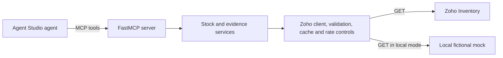

# Zoho Inventory connector for Razorpay Agent Studio

## The merchant problem

**Fictional merchant:** Kaveri Home Goods, a Bangalore home-decor seller using Razorpay Checkout and Zoho Inventory. No merchant interview or real customer data is represented here.

The stated asks are “recover more abandoned carts” and “win more chargebacks.” The problem hypothesis is narrower: cart agents may offer discounts for unavailable or scarce items, while dispute agents may lack order and fulfillment facts that operations staff have to assemble by hand. The connector adds read-only inventory and order context so an agent can make a better-informed decision and say exactly which evidence is missing.

The project measures three things: **M1** nudges and fictional discount spend associated with unavailable stock; **M2** how often seeded disputes have complete fulfillment evidence; and **M3** upstream calls per decision and estimated quota use. The saved `eval/results/` outputs report **SIMULATED** results on fictional seed-42 data: M1 out-of-stock nudges go from 54/200 (27%) in the baseline policy to 0/200 in the connector-aware policy, with ₹29,562.20 simulated discount spend saved; M2 is complete for 18/40 cases (45%) and partial for 22/40; M3 is 0.15 upstream calls per cart decision, 87.85% cache hits, and an estimated 3% of a 1,000-call daily quota for the cart simulation (11.4% across both simulations). These are policy-simulation outputs, not merchant impact or a live connector benchmark. Reproduce them with `make eval`.

**Live mode: not yet verified.** No real Zoho organization run or live screenshots are claimed. See [docs/INSPECTOR_DEMO.md](docs/INSPECTOR_DEMO.md) for the current mock and live inspection paths.

## Quickstart

Requires Python 3.11+ and `uv`.

```bash
make setup
make eval
make demo
```

`make eval` runs the deterministic simulation. `make demo` starts the fictional mock API and the MCP server over stdio, then drives three stock decisions, a dispute evidence lookup, and an injected throttling/backoff case through an MCP client. To start the mock API directly, use `make mock-server`; it serves at `http://127.0.0.1:8000`.

### Live Zoho (read-only smoke path)

1. Copy `.env.example` to `.env`; configure an isolated Zoho test organization and OAuth client. Never place credentials in Git or chat.
2. Ensure the local shell exports `ZOHO_CLIENT_ID`, `ZOHO_CLIENT_SECRET`, `ZOHO_REFRESH_TOKEN`, and `ZOHO_ORG_ID`. The Makefile does not load `.env` automatically. `make zoho-token` can perform the local authorization-code flow and save the refresh token to the ignored `ZOHO_TOKEN_FILE` path.
3. For the optional fictional live-trial fixtures, first review the write scopes and safeguards in `docs/API_NOTES.md` and `scripts/seed_zoho.py`; use only a throwaway organization. Then run `make live-smoke`. It skips cleanly when the required read credentials are absent and prints only masked tool summaries.

Live credentials and a real Zoho organization are not present in this workspace. No live call has been made. Do not seed any organization containing real merchant data. The seed script writes fictional records and requires an explicit `--i-understand-this-writes` flag plus separate `ZOHO_SEED_*` credentials.

## What is implemented

The source registers eight FastMCP tools and exports a checked-in specification at `mcp/tool_spec.json`. Zoho Inventory access is GET-only; OAuth token refresh uses the required Accounts token endpoint. The connector applies projections and input validation, and includes token management, an in-process cache, rate limiting, and a deterministic mock API. See [docs/DESIGN.md](docs/DESIGN.md), [docs/TOOLS.md](docs/TOOLS.md), and [docs/LIMITATIONS.md](docs/LIMITATIONS.md) for the verified behavior and gaps.



The intended integration shape is an Agent Studio agent calling the connector as an MCP server. This repository does not wire into Razorpay's production Agent Studio runtime. Agent Studio context here is limited to the public-facing product description in the project brief.

## Public Agent Studio context

Razorpay's public launch announcement describes Agent Studio as a B2B agent marketplace and builder built on Anthropic's Claude Agent SDK; it names abandoned-cart recovery and dispute response among its agents. The announcement names Nugget by Zomato and SuperU as build partners for the cart agent. This project demonstrates an MCP-compatible integration shape only. How Agent Studio registers a private connector, routes tool calls, or stores per-merchant credentials is not public in the sources reviewed and remains an assumption; no Agent Studio runtime integration was tested here. [Razorpay launch announcement](https://razorpay.com/newsroom/?p=4704), [Agent Studio overview](https://razorpay.com/blog/agent-studio-ai-agents-by-razorpay/).

Public commentary has asked whether personalized offers could create price-discrimination or dark-pattern risks. Razorpay's public response says offers are bounded by merchant-configured coupon rules. This connector supplies stock context only; it neither chooses nor sends offers. [MediaNama's coverage and Razorpay response](https://www.medianama.com/2026/03/223-razorpay-chief-product-officer-ai-agent-studio-pricing-compliance-concerns/).

## Documentation

- [Design and trade-offs](docs/DESIGN.md)
- [Tool examples](docs/TOOLS.md)
- [Agent capabilities](docs/AGENT_CAPABILITIES.md)
- [Merchant discovery plan](docs/MERCHANT_DISCOVERY.md)
- [Merchant operations summary](docs/MERCHANT_SUMMARY.md)
- [Limitations and production fixes](docs/LIMITATIONS.md)
- [Three-minute walkthrough](docs/WALKTHROUGH.md)
- [MCP Inspector guide](docs/INSPECTOR_DEMO.md)
- [API verification notes](docs/API_NOTES.md)
- [Measurement framework](docs/MEASUREMENT.md)
- [Assumptions](docs/ASSUMPTIONS.md)
- [Completion checklist](docs/DONE_CHECKLIST.md)

## Live verification

**Status: not yet verified.** `docs/assets/` has no author-provided live evidence. Add screenshots and change this status only after the author has run the live smoke path against a real, throwaway Zoho Inventory organization and confirmed the result.
