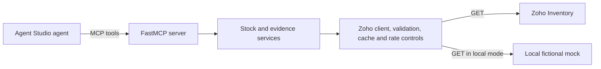

# Zoho Inventory connector for Razorpay Agent Studio

This is a read-only MCP connector that reports Zoho stock availability to cart agents and assembles recorded order and fulfillment evidence for dispute agents.

## The merchant problem

**Fictional merchant:** Kaveri Home Goods, a Bangalore home-decor seller using Razorpay Checkout and Zoho Inventory. No merchant interview or real customer data is represented here.

The stated asks are “recover more abandoned carts” and “win more chargebacks.” The hypothesis is that cart agents may discount unavailable items, while dispute agents may lack fulfillment facts that ops assembles by hand.

## SIMULATED results

| Measure | Result | Boundary |
|---|---|---|
| Cart policy mechanism | At the fixture's assumed 27% out-of-stock share: 54/200 baseline nudges versus 0 under the connector-aware rule | Zero is by construction, not measured impact. |
| Zoho-documented dispute evidence fields | 18/40 mock cases contain order, invoice, package, shipment status, carrier, and tracking | Fixture result; not live Zoho coverage. |
| Delivery proof | 0/40 in the schema-faithful assessment | Requires a carrier-tracking integration. |
| Quota feasibility | Warm fixture: 0.15 calls/decision → 6,666 / 3,333 / 1,666 decisions at 100% / 50% / 25% quota. Cold cache: 1.235 calls/decision → 809 / 404 / 202. | Assumes a 1,000-call daily cap; actual hit rate depends on catalog size and traffic skew and must be measured. |

**SIMULATED M1 sensitivity** (same fictional discount offers; seed 42):

| Assumed out-of-stock share | Unavailable nudges, baseline → aware | Wasted discount, baseline → aware (fictional INR) |
|---:|---:|---:|
| 2% | 4 → 0 | ₹924.60 → ₹0.00 |
| 5% | 10 → 0 | ₹2,389.00 → ₹0.00 |
| 10% | 20 → 0 | ₹4,493.30 → ₹0.00 |
| 27% | 54 → 0 | ₹13,315.40 → ₹0.00 |

The connector-aware zero is guaranteed by its suppression rule; neither column estimates merchant impact. Measure the merchant's real out-of-stock share first. All evaluation outputs are **SIMULATED**; reproduce the tables with `make eval`.

**Delivery-proof gap:** Zoho documents shipment status, carrier and tracking number, but no delivered-at timestamp. A Zoho-only connector cannot provide carrier-confirmed delivery proof for chargebacks; the likely long-term fix is a carrier-tracking integration, validated with the merchant.

**Live mode: not yet verified.** A signed-in Zoho Inventory dashboard was observed with a Premium trial showing 14 days remaining and setup at 0%. That organization is institutional and is explicitly excluded from testing: no records, scopes, or credentials were created there. The author will create and manage a separate throwaway organization under a personal Zoho account before any live run. The observed Premium-trial quota is 10,000 requests/day; this does not establish free-plan behavior (documented as 1,000/day) or validate connector quotas in the new organization. See [docs/INSPECTOR_DEMO.md](docs/INSPECTOR_DEMO.md) for the mock and live inspection paths.

## Quickstart

Requires Python 3.11+ and `uv`.

```bash
make setup
make eval
make demo
```

`make eval` runs the deterministic simulation. `make demo` starts the fictional mock API and the MCP server over stdio, then drives three stock decisions, a dispute evidence lookup, and an injected throttling/backoff case through an MCP client. To start the mock API directly, use `make mock-server`; it serves at `http://127.0.0.1:8000`.

### Live Zoho (read-only smoke path)

1. Copy `.env.example` to `.env`; configure an isolated Zoho test organization and OAuth client. Never place credentials in Git or chat.
2. Ensure the local shell exports `ZOHO_CLIENT_ID`, `ZOHO_CLIENT_SECRET`, and `ZOHO_ORG_ID`; `ZOHO_DC=in` for India. Make does not load `.env` automatically. Run `make zoho-token` to exchange a grant code entered at a hidden prompt; it stores the refresh token in the ignored `ZOHO_TOKEN_FILE` path with mode `0600`.
3. Follow [the live bring-up runbook](docs/LIVE_BRINGUP.md): run preflight, exchange the grant, repeat preflight, then smoke, probe, and assert. Inventory resource calls are read-only; the token helper only exchanges OAuth credentials. The separate optional seed script is not part of this path; do not seed an organization unless you explicitly choose to use its write scopes and safeguards.

No approved throwaway-org credentials were exported in the shell during this offline preparation, and no live call has been made. Do not seed the institutional organization or any organization containing real merchant data. The seed script writes fictional records and requires an explicit `--i-understand-this-writes` flag plus separate `ZOHO_SEED_*` credentials.

## What is implemented

The source registers eight FastMCP tools and exports a checked-in specification at `mcp/tool_spec.json`. Zoho Inventory access is GET-only; OAuth token refresh uses the required Accounts token endpoint. The connector applies projections and input validation, and includes token management, an in-process cache, rate limiting, and a deterministic mock API. See [docs/DESIGN.md](docs/DESIGN.md), [docs/TOOLS.md](docs/TOOLS.md), and [docs/LIMITATIONS.md](docs/LIMITATIONS.md) for the verified behavior and gaps.



The intended integration shape is an Agent Studio agent calling the connector as an MCP server. This repository does not wire into Razorpay's production Agent Studio runtime. Agent Studio context here is limited to the public-facing product description in the project brief.

## Public Agent Studio context

Razorpay's public launch announcement describes Agent Studio as a B2B agent marketplace and builder built on Anthropic's Claude Agent SDK; it names abandoned-cart recovery and dispute response among its agents. The announcement names Nugget by Zomato and SuperU as build partners for the cart agent. This project demonstrates an MCP-compatible integration shape only. How Agent Studio registers a private connector, routes tool calls, or stores per-merchant credentials is not public in the sources reviewed and remains an assumption; no Agent Studio runtime integration was tested here. [Razorpay launch announcement](https://razorpay.com/newsroom/?p=4704), [Agent Studio overview](https://razorpay.com/blog/agent-studio-ai-agents-by-razorpay/).

Public commentary has asked whether personalized offers could create price-discrimination or dark-pattern risks. Razorpay's public response says offers are bounded by merchant-configured coupon rules. This connector supplies stock context only; it neither chooses nor sends offers. [MediaNama's coverage and Razorpay response](https://www.medianama.com/2026/03/223-razorpay-chief-product-officer-ai-agent-studio-pricing-compliance-concerns/).

## Documentation

- [Design and trade-offs](docs/DESIGN.md)
- [Tool examples](docs/TOOLS.md)
- [Agent capabilities](docs/AGENT_CAPABILITIES.md)
- [Merchant discovery plan](docs/MERCHANT_DISCOVERY.md)
- [Merchant operations summary](docs/MERCHANT_SUMMARY.md)
- [Merchant summary technical appendix](docs/MERCHANT_SUMMARY_TECHNICAL.md)
- [Limitations and production fixes](docs/LIMITATIONS.md)
- [Three-minute walkthrough](docs/WALKTHROUGH.md)
- [MCP Inspector guide](docs/INSPECTOR_DEMO.md)
- [Live bring-up runbook](docs/LIVE_BRINGUP.md)
- [API verification notes](docs/API_NOTES.md)
- [Measurement framework](docs/MEASUREMENT.md)
- [Assumptions](docs/ASSUMPTIONS.md)
- [Completion checklist](docs/DONE_CHECKLIST.md)

## Live verification

**Status: not yet verified.** `docs/assets/` has no author-provided live evidence. Add screenshots and change this status only after the author has run the live smoke path against a real, throwaway Zoho Inventory organization and confirmed the result.
