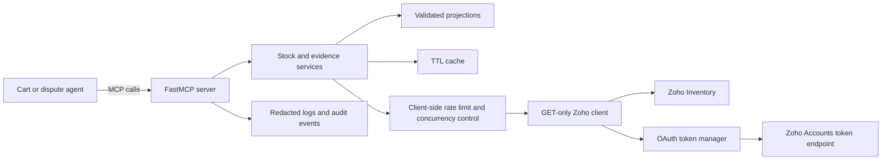
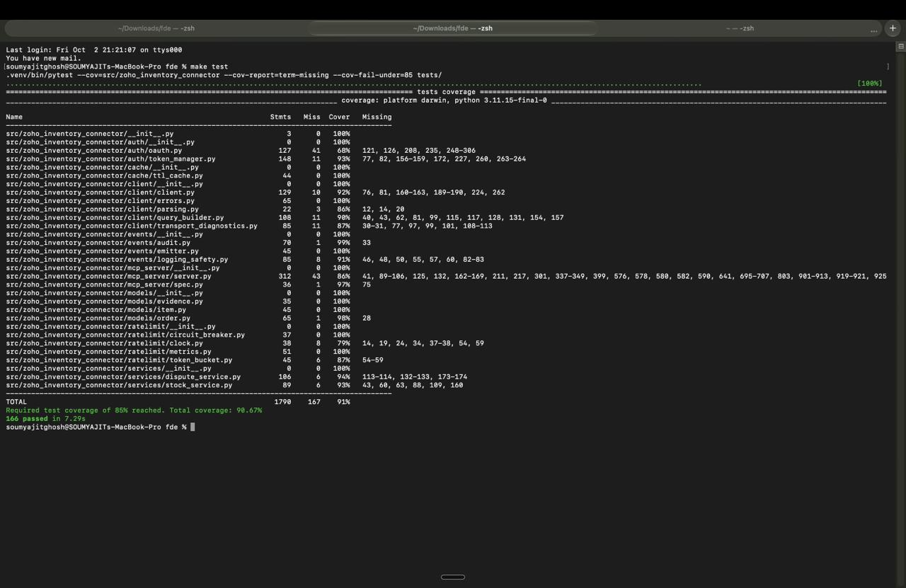
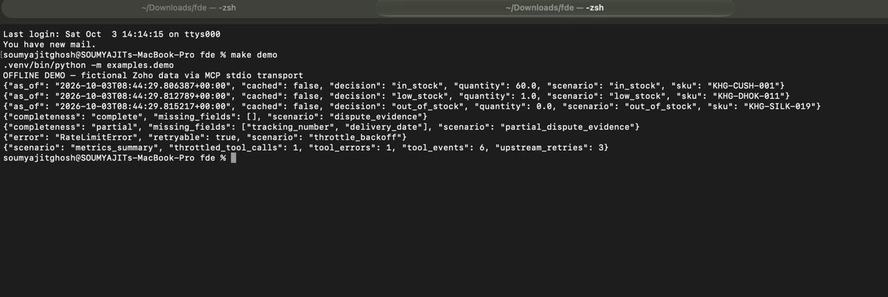
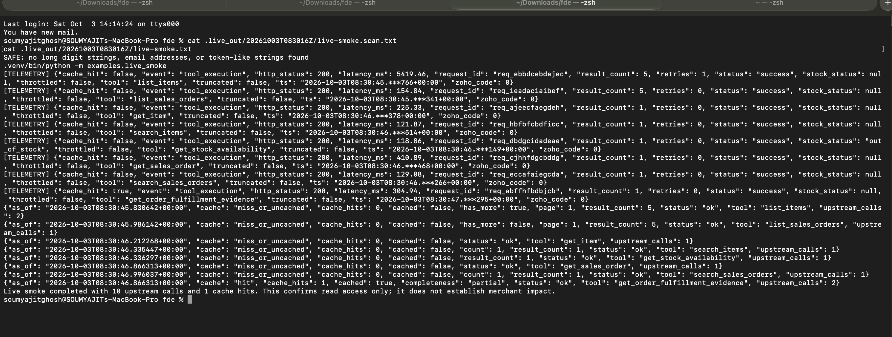
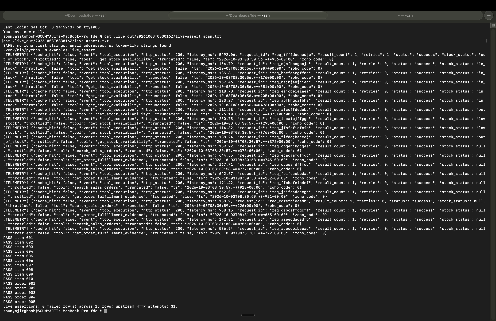
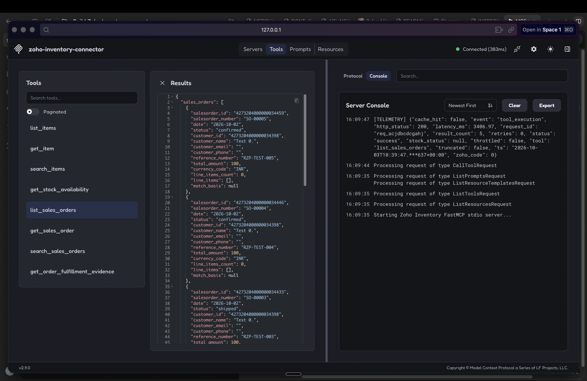
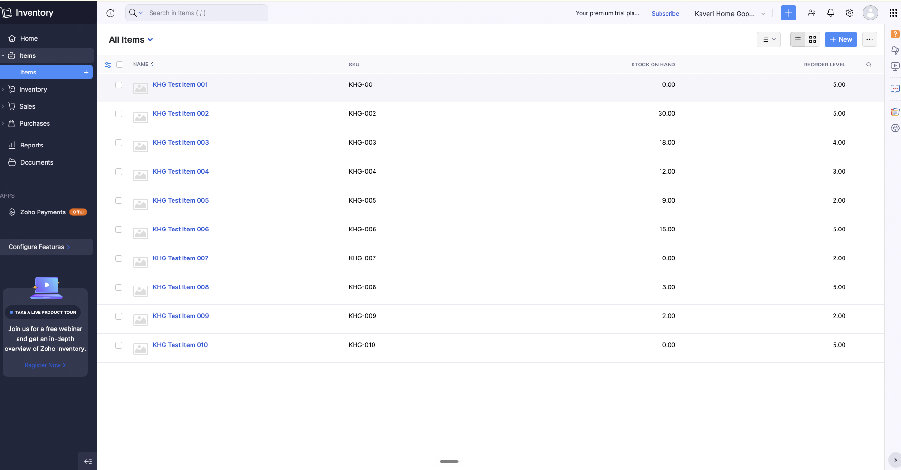
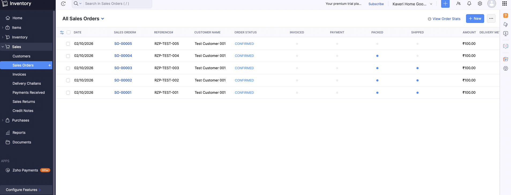

# Zoho Inventory connector for Razorpay Agent Studio

A read-only MCP connector that tells Razorpay Agent Studio's cart and dispute agents whether an item is sellable and what fulfillment evidence exists in Zoho Inventory.

## The problem

**Kaveri Home Goods is fictional.** Its stated asks are to recover more abandoned carts and win more chargebacks. The narrower hypothesis is that cart agents may offer discounts for unavailable stock, while dispute agents may lack shipment facts that operations staff assemble by hand.

In the failure scenario, a shopper abandons a cart with an item the merchant cannot ship, and the cart agent still offers a discount for it. A stock check first gives the agent's configured policy a chance to suppress or change that nudge.

Stock awareness can prevent an agent from treating physical stock as sellable stock. A single evidence lookup can show which order and fulfillment fields Zoho has recorded, and which are missing. Neither result authorizes an offer or proves a chargeback should win.

## What I found

> **Stock signal.** Without a connector, a cart agent has no normalized Zoho availability signal. A manual UI observation in the throwaway org showed four items with available-for-sale quantities one below on-hand (18/17, 12/11, 9/8, 15/14); another showed accounting stock 30, physical stock 29 and available-for-sale 29. This was read by hand in Zoho's UI, not returned by the API; the API-field mapping is unconfirmed. [Manual UI observations](docs/LIVE_FINDINGS.md#manual-ui-observations)
>
> **Delivery proof.** Live package responses included `shipment_delivered_date`, but it was blank on the three matching shipped records checked and does not establish carrier confirmation. For reliable chargeback delivery proof, the long-term fix remains a carrier-tracking integration. [Live findings](docs/LIVE_FINDINGS.md)
>
> **Zoho's package list ignored the sales-order filter.** The live run found cross-order packages despite a `salesorder_id` filter. The connector now exact-filters returned order IDs before using shipment evidence and fetches package detail when nested shipment data is sparse. Without that check, a dispute lookup could attach another order's tracking number. Regression coverage: `test_dispute_service_ignores_packages_for_other_orders`. [Live findings](docs/LIVE_FINDINGS.md)
>
> **Quota.** On the fixture's warm cache, the model supports about 6,666 / 3,333 / 1,666 decisions per day if 100% / 50% / 25% of a 1,000-call quota is available. The cold-cache fixture supports 809 / 404 / 202. These are simulated capacity estimates, not live usage. [eval output](eval/results/summary.json)

## Results (SIMULATED)

| Measure | SIMULATED result | How to read it |
|---|---:|---|
| Cart mechanism check | 54/200 baseline nudges target fixture carts labeled out of stock (27%); connector-aware policy: 0/200 | The zero is true by construction: the policy suppresses every fixture cart labeled out of stock. It is not measured impact. |
| Wasted-nudge and discount sensitivity | Assumed out-of-stock rate: 2%: 4→0 nudges / ₹924.60→₹0; 5%: 10→0 / ₹2,389.00→₹0; 10%: 20→0 / ₹4,493.30→₹0; 27%: 54→0 / ₹13,315.40→₹0 | Baseline→aware; fixture counts and fictional INR from the fixed seed and offers. |
| Quota, warm cache | 0.15 calls/decision: 6,666 / 3,333 / 1,666 decisions at 100% / 50% / 25% of 1,000 calls/day | Fixture cache hit rate; real rate depends on catalog size and traffic skew. |
| Quota, cold cache | 1.235 calls/decision: 809 / 404 / 202 decisions at 100% / 50% / 25% of 1,000 calls/day | Fixture SKU mix; a distinct SKU miss requires an upstream call. |
| Dispute evidence | 18/40 cases have all six Zoho-documented fields; 0/40 have schema-faithful delivery proof | SIMULATED. The 0/40 measure reflects the pre-live reading of the documented schema; live responses included a blank `shipment_delivered_date` on the tested shipments, not carrier-confirmed proof. |

The first real measurement should be the merchant's out-of-stock rate, followed by actual cache behavior, shared Zoho quota, and the merchant's definition of sellable stock. Reproduce the simulated numbers with `make eval`; metric definitions and a controlled measurement plan are in [MEASUREMENT.md](docs/MEASUREMENT.md).

### What a decision looks like

These are excerpts from `make demo` against the local fictional mock. Values are unedited; fields are trimmed for readability.

**MOCK / SIMULATED output — out of stock**

```json
{"decision":"out_of_stock","quantity":0.0,"sku":"KHG-SILK-019"}
```

**MOCK / SIMULATED output — partial fulfillment evidence**

```json
{"completeness":"partial","missing_fields":["tracking_number","delivery_date"]}
```

## Live verification status

**Offline work is verified by tests, evaluation and demo; live Zoho verification passed on 2026-10-03 against a throwaway India org on a Premium trial.** Token exchange, preflight, all eight tools, the read-only probe, and 15/15 live assertions passed. The first assertion run failed and exposed a package-association bug: Zoho's package list returned rows for other orders despite a sales-order filter. Exact local filtering and sparse shipment-detail lookup fixed it; `test_dispute_service_ignores_packages_for_other_orders` covers the regression. Live responses included `shipment_delivered_date`, blank on the three matching shipped records checked. A populated Zoho-entered date would still not establish carrier confirmation. Invoice-present remains mock-only because the org's migration date blocked invoice creation; Free-plan quota behavior and Agent Studio runtime integration were not tested. Current screenshots include mock test/demo, live smoke/assertion, Zoho UI, and a successful MCP Inspector tool call; the evaluation capture needs recapture, while preflight and probe captures are still outstanding. See [DONE_CHECKLIST.md](docs/DONE_CHECKLIST.md) and [LIVE_FINDINGS.md](docs/LIVE_FINDINGS.md).

### Live evidence

The successful run's step outputs and scans exist under the gitignored `.live_out/20261003T083016Z/`: environment validation, host watch, token status, preflight, smoke, probe, and assertion. Preflight used 7 upstream calls; smoke used 10; the probe made 16 HTTP attempts; assertions passed 15/15 with 31 HTTP attempts. These files are local evidence and are not committed. Genuine screenshots include the test and demo mock captures, live smoke/assertion captures, Zoho UI captures, and a successful live Inspector tool call. The evaluation capture is stale; preflight and probe captures remain missing. See the [capture guide](docs/assets/CAPTURE_GUIDE.md) for the exact checklist and privacy review requirements. No screenshot content was edited.

## What the agent can and cannot do

| CAN | CANNOT | DEPENDS ON |
|---|---|---|
| Read normalized items, stock, sales orders and recorded fulfillment fields. | Create or edit records, adjust stock, issue refunds, send discounts, or submit a dispute response. | Correct OAuth scopes, organization, data center and Zoho access. |
| Return an advisory availability status with time and cache metadata. | Reserve stock, guarantee real-time availability, or guarantee fulfillment. | Merchant definition of sellable stock, reservations, location rules and freshness limits. |
| Assemble evidence and list missing fields. | Invent missing evidence or independently prove delivery. | Whether Zoho records are linked and a carrier source is available. |
| Search orders and return the matching basis. | Assume a supplied payment ID belongs to a Zoho order. | Whether a unique Razorpay ID is stored in a supported Zoho field. |

### MCP tools

| Tool | Purpose | Use it when | Do not use it when |
|---|---|---|---|
| `list_items` | Browse item catalog | The agent needs a bounded catalog page. | Deciding current sellability for a cart. |
| `get_item` | Retrieve one item | A known item ID needs inspection. | Searching broadly or replacing the stock decision tool. |
| `search_items` | Find items by name/SKU | The agent has a product phrase or SKU. | Treating a search result as a real-time stock reservation. |
| `get_stock_availability` | Classify requested SKUs as in, low, out or unknown | Before a cart-nudge decision. | Making a policy decision without the merchant's rules or acting on stale/error data. |
| `list_sales_orders` | Browse sales orders | A bounded order list is needed. | Matching a payment without checking the match basis. |
| `get_sales_order` | Retrieve one known order | The sales-order ID is already verified. | Guessing an ID or searching from an unverified payment reference. |
| `search_sales_orders` | Search by reference/Razorpay ID text and exact-compare; optional email path resolves contacts then looks up by customer ID | The merchant's mapping field is known and the match can be checked; email path is unverified end to end against Zoho. | Accepting an ambiguous result as proof of payment/order identity. |
| `get_order_fulfillment_evidence` | Gather order, invoice, package and shipment evidence | A dispute is already matched to a verified Zoho order. | Submitting a rebuttal or claiming carrier-confirmed delivery. |

See [AGENT_CAPABILITIES.md](docs/AGENT_CAPABILITIES.md) for the full boundary table and [TOOLS.md](docs/TOOLS.md) for example inputs and outputs.

## Run it in 3 commands

Requires Python 3.11+ and `uv`.

Repository: [https://github.com/somuai/razorpay-agent-studio-zoho-connector](https://github.com/somuai/razorpay-agent-studio-zoho-connector)

```bash
make setup
make eval
make demo
```

These commands set up the environment, run deterministic fictional evaluation, and exercise the MCP tools against the local mock. Live commands read credentials from the environment and should be run from the author's own terminal; follow [LIVE_BRINGUP.md](docs/LIVE_BRINGUP.md).

## How it is built



Six design decisions and their trade-offs:

| Decision | Trade-off |
|---|---|
| Read-only Inventory calls | Prevents accidental writes; cannot repair a merchant's records. |
| Composed stock and evidence tools | Answers an agent's decision question; hides some raw endpoint detail. |
| Projection models | Limits fields sent to the agent; requires explicit updates when Zoho shapes change. |
| Client-side rate limiting and TTL cache | Reduces calls for one process; does not coordinate multiple replicas or other Zoho consumers. |
| Missing values become `not_available` or `unknown` | Avoids guessing; agents may need to hand off more cases. |
| Redacted logs and separate audit events | Supports diagnosis with minimized identifiers; cannot control retention in a future host runtime. |

## What I would do first with a real merchant

1. What does “sellable” mean across warehouses, reservations and checkout channels?
2. How often does stock change, and what stale-data window is acceptable?
3. What should happen when one cart line is unavailable or low?
4. Which system and carrier provide the evidence and timestamp needed for a chargeback?
5. How is a Razorpay order or payment matched to a Zoho sales order, and how much shared API quota is available?

Each question, the hypothesis it tests, requested data and design-changing answer are in [MERCHANT_DISCOVERY.md](docs/MERCHANT_DISCOVERY.md).

## Limitations and production path

- **Live verification covers the tested read-only path and records only.** The Premium-trial run passed, but invoice-present, Free-plan quota, Agent Studio runtime loading, and carrier-confirmed delivery remain unverified.
- **Zoho's delivered-date field is not carrier proof.** A live `shipment_delivered_date` field was blank on the three shipments checked; validate its source with the merchant and integrate the carrier or another approved authoritative tracking source.
- **Zoho package listing ignored the sales-order filter in the tested org.** The connector now exact-filters returned rows, but bounded pagination or a verified server-side filter is needed before larger catalogs.
- **Sellability is merchant-specific.** Validate availability fields, reservations, safety stock and warehouse allocation before an agent acts.
- **Quota and cache are not shared across replicas.** Measure org-wide usage and add shared coordination if deployment needs it.
- **Order matching depends on field mapping.** Confirm the unique Razorpay reference field and define ambiguity handling with operations.
- **Evaluation is simulated and Agent Studio runtime wiring is not included.** Run an approved shadow period, define stop criteria, and confirm the private connector and credential contract with an authorized Razorpay owner.

More detail and the evidence required for each fix are in [LIMITATIONS.md](docs/LIMITATIONS.md).

## Docs index

- [API notes and sources](docs/API_NOTES.md)
- [Assumptions](docs/ASSUMPTIONS.md)
- [Design decisions](docs/DESIGN.md)
- [Completion checklist and command evidence](docs/DONE_CHECKLIST.md)
- [Inspector demo](docs/INSPECTOR_DEMO.md)
- [Limitations and fixes](docs/LIMITATIONS.md)
- [Live bring-up runbook](docs/LIVE_BRINGUP.md)
- [Live findings](docs/LIVE_FINDINGS.md)
- [Live test-data checklist](docs/LIVE_TEST_DATA.md)
- [Measurement plan](docs/MEASUREMENT.md)
- [Merchant discovery questions](docs/MERCHANT_DISCOVERY.md)
- [Merchant summary](docs/MERCHANT_SUMMARY.md)
- [Merchant summary technical appendix](docs/MERCHANT_SUMMARY_TECHNICAL.md)
- [Project plan](docs/PLAN.md)
- [Tool schemas and examples](docs/TOOLS.md)
- [Three-minute walkthrough](docs/WALKTHROUGH.md)
- [Screenshot capture guide](docs/assets/CAPTURE_GUIDE.md)
- [Live evidence directory note](docs/assets/README.md)


## Assignment checklist

| Brief requirement | Status | Evidence |
|---|---|---|
| Working OAuth or API-key flow | Implemented: Zoho OAuth 2.0 Self Client grant and refresh-token flow. | [Auth tests](tests/test_auth.py), [OAuth flow tests](tests/test_oauth_flows.py), `make test` |
| List/get/search primitives | Implemented: item, stock, order and fulfillment tools. | [Tool docs](docs/TOOLS.md), [server](src/zoho_inventory_connector/mcp_server/server.py), `make spec` |
| Rate-limit handling | Implemented: token bucket, bounded retry, Retry-After when supplied, quota and circuit errors. | [API limits](docs/API_NOTES.md#limits-and-error-codes), [client tests](tests/test_client.py), `make test` |
| MCP tool specification | Implemented: generated specification with eight registered tools. | [Tool spec](mcp/tool_spec.json), [spec tests](tests/test_spec.py), `make spec` |
| What the agent can and cannot do | Documented. | [Capabilities](docs/AGENT_CAPABILITIES.md), [merchant summary](docs/MERCHANT_SUMMARY.md) |
| Setup and run instructions | Documented; mock quickstart is offline after setup. | `make setup`, `make eval`, `make demo`; [Inspector guide](docs/INSPECTOR_DEMO.md) |
| Assumptions and limitations | Documented, including private Agent Studio connector loading and credential storage assumptions. | [Assumptions](docs/ASSUMPTIONS.md), [limitations](docs/LIMITATIONS.md) |
| No secrets or real customer data | Fictional fixtures; secret scan passes. | `make check-secrets`, [mock fixtures](mock_zoho/fixtures/) |

## How authentication works

1. Create a Zoho Self Client and request only the read scopes listed in [API_NOTES.md](docs/API_NOTES.md).
2. Exchange the short-lived grant for a refresh token; the saved token is bound to the client credentials that issued it.
3. Cache the access token and its expiry in a private `0600` token file; reuse it while more than five minutes remain.
4. A process-local single-flight lock shares one refresh among concurrent requests in that process. Separate processes reuse a valid cached token; if none is valid, they may refresh independently.
5. Route Inventory calls to the `api_domain` returned by Zoho, with the configured data center as fallback.

Zoho documents token-generation limits, including at most ten access-token requests in ten minutes. Cross-process caching reduces avoidable requests; it does not raise Zoho's limits, and refreshes across processes are not globally single-flight. See [token limits and cache behavior](docs/API_NOTES.md#authentication-and-data-center-routing).

## Zoho limits and how they are handled

| Limit | Documented value | Connector behavior |
|---|---:|---|
| Per-minute requests | 100 per organization | Client token bucket defaults to 80/minute. |
| Daily plan quota | Free 1,000; Standard 2,000; Professional 5,000; Premium and Enterprise 10,000 requests/day | Quota estimate is plan-configurable; shared use by other org consumers must be included. |
| Concurrent requests | Free 5; paid 10 (soft limit) | Semaphore defaults to 5. |
| Code 44 | Org/account blocked after per-minute limit | Opens a cooldown circuit and fails fast. |
| Code 45 | Daily plan quota exceeded | No retry; returns quota-exhausted guidance. |
| Code 1070 | Concurrent request limit exceeded | Classifies as concurrency pressure; retries are bounded. |
| HTTP 429 / `Retry-After` | 429 is documented; universal header contract is unverified | Honors a supplied `Retry-After` within a cap; otherwise bounded backoff. |

Source and uncertainty notes: [API_NOTES.md — limits and error codes](docs/API_NOTES.md#limits-and-error-codes).

## Where this fits

Razorpay describes Agent Studio publicly as a platform for merchants to deploy or build business agents, including abandoned-cart and dispute workflows. This connector is a read-only MCP-style bridge from those agents to Zoho Inventory facts. Private connector loading and credential storage are not public; an MCP-compatible interface and per-merchant credential arrangement are assumptions, not tested Razorpay integration details. See [public sources and boundaries](AGENTS.md#what-agent-studio-is-public-information-only).

## Quality

Fresh offline gates on 2026-10-03: **168 tests passed; 90.67% source coverage; lint clean (102 files formatted); typecheck clean (31 source files); 8 MCP tools registered.** Sources: `make test`, `make lint`, `make typecheck`, and `make spec`; captured mock outputs are in [docs/evidence](docs/evidence/).

## Screenshots

The images below are the uploaded, author-captured screenshots. The HEIC originals are retained in `docs/assets/`; PNG copies are included where needed for GitHub README rendering. No screenshot content was edited.





The live run and assertion captures show the command output and its safety scan:





The Inspector capture shows a successful live `list_sales_orders` tool call:



The Zoho UI captures show the fictional inventory and sales-order records:





The evaluation screenshot `eval_simulated_stale.jpg` predates the corrected delivery-date explanation and is retained but not displayed. Preflight and probe screenshots remain unavailable. See the [capture guide](docs/assets/CAPTURE_GUIDE.md); `make screenshots-check` lists files present and missing.

<!-- MOCK slots: tests_passing.jpg (present); eval_simulated.jpg (recapture needed; stale copy is eval_simulated_stale.jpg); demo_mock.jpg (present).
LIVE slots: live_preflight_masked.png/.jpg/.heic (missing); live_smoke_masked.png (present); live_probe_findings.png/.jpg/.heic (missing); live_assert_masked.png (present); mcp_inspector_live.png (present); Zoho UI item/order PNG captures (present).
Never replace a missing or stale slot with generated or edited output. -->

## Evidence files

- [MOCK / SIMULATED test output](docs/evidence/make-test.txt)
- [MOCK / SIMULATED evaluation output](docs/evidence/make-eval.txt)
- [MOCK demo output](docs/evidence/make-demo.txt)
- [FDE engineering field notes](docs/FIELD_NOTES.md)
- [Submission note](docs/SUBMISSION_NOTE.md)
