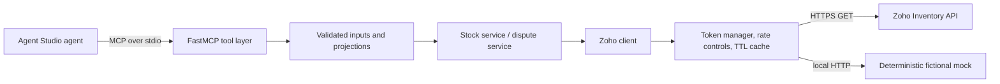

# Design and trade-offs

## Workflow before endpoints

Kaveri Home Goods is a fictional example, not an interviewed merchant. The design hypothesis is that stock-blind cart recovery can waste discounts and that dispute operations may have to gather order, invoice, package, and shipment facts from separate records. The two composed primitives are `get_stock_availability` and `get_order_fulfillment_evidence`; raw list/get/search tools support discovery and reconciliation around them.

## Decisions

| Decision | Why | Cost or boundary |
|---|---|---|
| Read-only connector surface | Inventory context should inform an agent without letting it mutate merchant records. | Corrections and order actions stay in Zoho or an explicitly authorized workflow. |
| Composed decision tools | A sellability result and a missing-evidence list are closer to agent decisions than raw endpoint payloads. | The stock rule and evidence fields must be validated against an actual merchant workflow. |
| Bounded projections and 8 KB cap | Keep irrelevant Zoho fields and oversized records out of the model context. | Large responses must be narrowed; cap behavior should be checked against all output shapes. |
| Default PII masking | Reduce customer data exposed to agent context. | The sales-order tool has an explicit `include_pii` option; deployments should keep it false unless needed. |
| In-process TTL cache and local limiter | Simple controls fit a single connector process and reduce repeat reads. | Cache is per-process and may be stale; it does not coordinate multiple replicas. |
| Deterministic mock and fixed seed | Permit offline development and reproducible policy simulations. | Mock success does not prove Zoho compatibility or live performance. |

The stock service uses an explicit `actual_available_stock` value or a single-location `location_actual_available_stock` value; it never substitutes physical `stock_on_hand`. If the available quantity is ambiguous across several locations, it returns `unknown`. Low stock uses `reorder_level` or a configurable default. These are code-level rules, not a verified definition of sellability for a merchant. The evidence service marks absent fields unavailable and preserves typed upstream errors rather than presenting them as empty evidence; delivery time and merchant-specific linkage still require live validation. See [Limitations](LIMITATIONS.md).

**Delivery-proof gap:** the reviewed Zoho shipment schema documents status, carrier and tracking number, but no delivered-at timestamp. A Zoho-only lookup cannot provide carrier-confirmed delivery proof for a chargeback. The production direction is a carrier-tracking integration, after discovery confirms which carriers and evidence fields the merchant needs.

The app-facing server is FastMCP over stdio. Tool telemetry goes to stderr; PII-minimized audit events go to a separate mode-0600 JSONL file selected by `ZOHO_AUDIT_LOG_FILE`. These local sinks still need deployment-level access and retention controls. The checked-in `mcp/tool_spec.json` is generated from the server's registered tool schemas.

## What I chose not to build and why

- **Write tools:** explicitly outside the connector's read-only job; order creation, stock adjustment, refunds, or dispute submission require separate authorization and controls.
- **Webhooks:** useful for lower-latency invalidation, but would add public ingress and lifecycle complexity before the polling and freshness need is measured.
- **Multi-tenant OAuth:** a single-organization local connector is enough to validate the interface; production tenancy needs tenant isolation and credential lifecycle design.
- **UI or database:** neither is needed for a small MCP read path; the audit sink is a local append-only JSONL file for this single-process prototype, not a multi-tenant audit database.
- **Distributed limiter:** the current deployment target is one process. A multi-replica deployment would need shared quota coordination.
- **Real merchant/customer data:** all fixtures remain fictional. No interview, data access, or uplift claim is implied.
- **Production Agent Studio runtime wiring:** this repo demonstrates an MCP integration shape only. It does not claim access to Razorpay internal interfaces.
- **Automated dispute filing or discount delivery:** evidence and stock context support human or agent decisions; taking external action needs a separately governed workflow.

## Production extensions tied to M1–M3

- **M1, wasted nudges:** validate which Zoho stock quantity means sellable for the merchant; measure stock freshness at decision time; add cache invalidation if 60-second staleness changes suppression decisions. Pilot against a control group before changing discount policy.
- **M2, evidence completeness:** map the merchant's actual package and carrier process, find where delivery confirmation is recorded, and measure missing fields by source. Zoho status/tracking alone is not carrier-confirmed delivery proof; add a verified carrier-tracking integration if the evidence gap is material. Never infer delivery.
- **M3, cost and quota:** compare agent request volume with all Zoho consumers, export call/cache/retry metrics, and use a shared limiter if running multiple replicas. Agree on a quota budget and stop conditions with operations.

## Current project readiness

The repository contains the MCP server, service layer, client, mock API, evaluation outputs, tool specification, offline demo, OAuth helper, live-smoke helper, and an isolated seeded-data helper. Live Zoho behavior remains unverified until the author runs the read-only smoke path in a disposable organization and confirms it.
